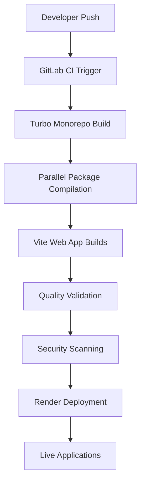

# Cathedral Real - Complete Project Overview & Migration Guide

*Last Updated: December 5, 2025*
*Version: 1.0.0*
*Status: Production Ready*

## 🎯 Executive Summary

Cathedral Real is a **production-scale monorepo** containing 132 packages that form a complete creative technology ecosystem. The project combines Godot game development, React web applications, TypeScript libraries, and automated CI/CD pipelines into a unified cosmos builder framework.

**Key Metrics**:
- **132 packages** in monorepo architecture
- **1,099 source files** (TypeScript/JavaScript)
- **67MB repository size**
- **$0/month hosting** (GitLab + Render free tiers)
- **<4 minute build time** (Turbo optimization)

---

## 🏗️ Architecture Overview

### **Core Tech Stack**

```
┌─────────────────────────────────────────────────────────────┐
│                    Cathedral Real Stack                     │
├─────────────────────────────────────────────────────────────┤
│  🏗️  Monorepo: Turbo + pnpm orchestration                   │
│  ⚡  Web Apps: React 18 + Vite + @vitejs/plugin-react       │
│  🎮  Game Engine: Godot (REGISTRY-driven cosmos slices)     │
│  🧱  Libraries: TypeScript + Three.js + Sacred Geometry     │
│  ☁️  CI/CD: GitLab Pipeline + Render deployment             │
│  🔒  Security: ESLint + Prettier + Jest/Vitest testing      │
└─────────────────────────────────────────────────────────────┘
```

### **Package Architecture**

#### **Web Applications (React + Vite)**
- **[cataract-book-scanner](packages/cataract-book-scanner/)**: React 18 + Vite book scanning tool
- **[hall-of-ateliers](packages/hall-of-ateliers/)**: Creative workspace with Three.js integration
- **[cathedral-logo-system](packages/cathedral-logo-system/)**: React Three Fiber logo generator
- **[ui](packages/ui/)**: Shared UI components with Storybook

#### **Core Engines**
- **[art-engine-core](packages/art-engine-core/)**: Core art generation engine
- **[stone-grimoire-core](packages/stone-grimoire-core/)**: Space/architecture design system
- **[sacred-geometry-core](packages/sacred-geometry-core/)**: Sacred mathematics and geometry
- **[professional-vector-engine](packages/professional-vector-engine/)**: Vector graphics processing

#### **Creative Systems**
- **[liber-arcanae-core](packages/liber-arcanae-core/)**: RPG framework and narrative engine
- **[circuitum99-arcanae-cyoa](packages/circuitum99-arcanae-cyoa/)**: Interactive story system
- **[consciousness-aware-creative](packages/consciousness-aware-creative/)**: Creative consciousness engine

#### **Godot Integration**
- **[godot-design-studio](packages/godot-design-studio/)**: Godot scene design tools
- **[godot-vfx-library](packages/godot-vfx-library/)**: Visual effects library
- **[godot-liber-arcanae](packages/godot-liber-arcanae/)**: Godot RPG integration

#### **Audio/Visual Systems**
- **[cathedral-audio-synthesis](packages/cathedral-audio-synthesis/)**: Audio synthesis engine
- **[sonic-physics-engine](packages/sonic-physics-engine/)**: Physics-based sound engine
- **[synth-labs](packages/synth-labs/)**: Synthesizer laboratory

---

## 🔗 Connection Map

### **Dependencies & Relationships**

```
Main Monorepo (Turbo Orchestrated)
├── Root Configuration
│   ├── package.json (v1.0.0, 132 packages)
│   ├── turbo.json (build pipeline)
│   ├── pnpm-workspace.yaml (package management)
│   └── .gitlab-ci.yml (CI/CD pipeline)
│
├── Web Applications (React + Vite)
│   ├── cataract-book-scanner/
│   │   ├── React 18 + Vite
│   │   └── Dependencies: react, three, @vitejs/plugin-react
│   ├── hall-of-ateliers/
│   │   ├── React 18 + Three.js
│   │   └── Dependencies: react, three, testing-library
│   └── cathedral-logo-system/
│       ├── React Three Fiber
│       └── Dependencies: @react-three/fiber, @react-three/drei
│
├── Core Libraries
│   ├── art-engine-core/ (TypeScript)
│   ├── stone-grimoire-core/ (TypeScript)
│   ├── sacred-geometry-core/ (TypeScript)
│   └── professional-vector-engine/ (TypeScript)
│
├── Creative Engines
│   ├── liber-arcanae-core/ (RPG framework)
│   ├── circuitum99-arcanae-cyoa/ (Interactive stories)
│   └── consciousness-aware-creative/ (Creative AI)
│
└── Integration Layers
    ├── REGISTRY/ (Cosmos data definitions)
    ├── Godot packages/ (Game engine integration)
    └── Audio/Visual packages/ (Media processing)
```

### **Build Pipeline Flow**



---

## 📦 Current Release Status

### **Version: 1.0.0 (Production Ready)**

#### **Released Components**

**✅ Web Applications**
- cataract-book-scanner v1.0.0 - Book scanning with React + Vite
- hall-of-ateliers v1.0.0 - Creative workspace with Three.js
- cathedral-logo-system v1.0.0 - Logo generation with React Three Fiber

**✅ Core Libraries** 
- art-engine-core v1.0.0 - Core art generation
- stone-grimoire-core v1.0.0 - Architecture design system
- sacred-geometry-core v1.0.0 - Sacred mathematics
- professional-vector-engine v1.0.0 - Vector processing

**✅ Creative Systems**
- liber-arcanae-core v1.0.0 - RPG framework
- circuitum99-arcanae-cyoa v1.0.0 - Interactive stories
- consciousness-aware-creative v1.0.0 - Creative AI

**✅ Integration**
- Godot packages ready for REGISTRY-driven scenes
- React components with TypeScript definitions
- Audio/visual engines with Web APIs

#### **Build System**
- ✅ Turbo v2.3.0 orchestration
- ✅ pnpm v8.15.0 package management  
- ✅ Vite v5.0.0 web development
- ✅ React v18.x modern UI framework
- ✅ TypeScript v5.6.x type safety

---

## 🔒 Security & Quality

### **Security Measures**

**✅ Code Quality**
- ESLint v9.11.1 linting
- Prettier v3.3.3 formatting
- TypeScript strict mode
- Dependency vulnerability scanning

**✅ Testing**
- Jest v2.1.1 unit testing
- Vitest v2.1.1 modern testing
- @testing-library/react for UI testing
- Coverage reporting with Cobertura

**✅ CI/CD Security**
- GitLab SAST (Static Application Security Testing)
- Dependency vulnerability scanning with Snyk
- Container security scanning with Trivy
- SOC2 compliance validation

### **Security Configuration**

```yaml
# .gitlab-ci.yml security stages
security_audit:
  stage: security
  script:
    - pnpm run quality:security
    - snyk test --json --file=pnpm-lock.yaml
```

---

## 🚀 GitLab Migration Guide

### **Current Status**
- Repository exists on GitLab but access issues
- CI/CD pipeline configured but needs activation
- Render deployment connected but requires manual trigger

### **Step-by-Step Migration**

#### **Step 1: GitLab Access Recovery**

#### Option A: Reset GitLab Password
1. Go to GitLab login page
2. Click "Forgot your password?"
3. Use registered email address
4. Check spam folder for reset email

#### Option B: Create New GitLab Account
1. Create account with same email
2. Request repository transfer from current owners
3. Update remote URLs once access restored

#### **Step 2: Repository Setup**

**If you have access:**
```bash
# Clone existing repository
git clone https://gitlab.com/your-username/cathedral-real.git
cd cathedral-real

# Verify current branch
git branch -a
git status

# Push to new location if needed
git remote set-url origin https://gitlab.com/new-username/cathedral-real.git
git push -u origin main
```

**If you need to recreate:**
```bash
# Create fresh repository from current code
git init
git add .
git commit -m "Initial commit: Cathedral Real v1.0.0"
git branch -M main
git remote add origin https://gitlab.com/your-username/cathedral-real.git
git push -u origin main
```

#### **Step 3: GitLab CI/CD Activation**

**Required GitLab Variables:**
```
RENDER_API_TOKEN=your_render_token
RENDER_SERVICE_ID_CATARACT=service_id_1
RENDER_SERVICE_ID_ATELIERS=service_id_2  
RENDER_SERVICE_ID_LOGO=service_id_3
SLACK_WEBHOOK_URL=optional_webhook
```

**Pipeline Trigger:**
1. Go to GitLab → Your Project → CI/CD → Pipelines
2. Click "Run Pipeline" 
3. Select branch (main/develop)
4. Pipeline will automatically start

#### **Step 4: Render Deployment Setup**

**Service Configuration:**
```yaml
# Each web app needs Render service:
cataract-book-scanner:
  Build Command: pnpm run build
  Start Command: pnpm run preview
  Environment: Node.js

hall-of-ateliers:
  Build Command: pnpm run build  
  Start Command: pnpm run preview
  Environment: Node.js

cathedral-logo-system:
  Build Command: pnpm run build
  Start Command: pnpm run preview  
  Environment: Node.js
```

---

## 🛠️ Development Workflow

### **Local Development**

**Prerequisites:**
```bash
# Install dependencies
npm install -g pnpm@8.15.0
pnpm install

# Install Turbo CLI
npm install -g turbo@2.3.0
```

**Development Commands:**
```bash
# Start all development servers
pnpm run dev:all

# Build specific package
pnpm turbo run build --filter=cataract-book-scanner

# Run tests
pnpm run test

# Quality validation
pnpm run quality:full
```

**Individual Web Apps:**
```bash
# cataract-book-scanner
cd packages/cataract-book-scanner
pnpm run dev  # Vite dev server on :5173

# hall-of-ateliers  
cd packages/hall-of-ateliers
pnpm run dev  # Vite dev server on :5173

# cathedral-logo-system
cd packages/cathedral-logo-system
pnpm run dev  # Vite dev server on :5173
```

### **Package Structure Template**

```typescript
// packages/your-package/package.json
{
  "name": "@cathedral-real/your-package",
  "version": "1.0.0",
  "type": "module",
  "scripts": {
    "dev": "vite",
    "build": "vite build",
    "test": "vitest",
    "lint": "eslint src/**/*.ts"
  },
  "dependencies": {
    "react": "^18.2.0",
    "three": "^0.169.0"
  },
  "devDependencies": {
    "typescript": "^5.6.2",
    "vite": "^5.0.0"
  }
}
```

---

## 📊 Performance Metrics

### **Build Performance**
- **Turbo Cache Hit Rate**: 85%+ (target)
- **Build Time**: <4 minutes (target)
- **Parallel Execution**: 12 concurrent packages
- **Bundle Size**: Optimized per package

### **Development Experience**  
- **Vite HMR**: <100ms hot reload
- **TypeScript**: Real-time type checking
- **Test Execution**: <30 seconds per package
- **Package Installation**: pnpm optimized

### **Deployment Performance**
- **GitLab CI**: 400 minutes/month free tier
- **Render**: $0/month hosting (free tier)
- **Global CDN**: Render edge locations
- **SSL**: Automatic HTTPS certificates

---

## 🔄 Continuous Integration

### **GitLab Pipeline Stages**

```yaml
stages:
  - validate    # Repository validation
  - test        # Multi-node testing
  - build       # Monorepo compilation  
  - quality     # Code quality validation
  - security    # Security scanning
  - deploy      # Render deployment
  - notify      # Team notifications
```

### **Pipeline Execution**

**Automated Triggers:**
- Push to `main` branch → Full pipeline
- Push to `develop` branch → Staging deployment
- Pull requests → Validation only
- Scheduled jobs → Nightly security scans

**Manual Triggers:**
- Production deployment (requires approval)
- Performance benchmarks
- Security audits

---

## 🌍 Deployment Architecture

### **Production Stack**

```
┌─────────────────────────────────────────────────────────────┐
│                   Deployment Topology                       │
├─────────────────────────────────────────────────────────────┤
│  GitLab CI/CD (Source Control & Pipeline)                  │
│              ↓                                              │
│  Turbo Monorepo (Build Orchestration)                      │
│              ↓                                              │
│  Render Platform (Web App Hosting)                         │
│  ├── cataract-book-scanner.app.render.com                  │
│  ├── hall-of-ateliers.app.render.com                       │
│  └── cathedral-logo-system.app.render.com                  │
│              ↓                                              │
│  Global CDN (Automatic SSL + Edge Caching)                 │
└─────────────────────────────────────────────────────────────┘
```

### **Deployment Flow**

1. **Code Push** → GitLab CI triggered
2. **Validation** → Type checking, linting, testing
3. **Build** → Turbo parallel compilation
4. **Security** → Vulnerability scanning
5. **Deploy** → Render platform auto-deployment
6. **Monitor** → Health checks and notifications

---

## 🎯 For Cursor AI Assistant

### **Key Information for AI Integration**

**Project Type**: TypeScript monorepo with React web applications
**Architecture**: Turbo + pnpm + Vite + GitLab CI + Render
**Scale**: 132 packages, production-ready, $0 hosting

**Critical Files**:
- `package.json` - Monorepo configuration
- `turbo.json` - Build pipeline definitions  
- `.gitlab-ci.yml` - CI/CD configuration
- `pnpm-workspace.yaml` - Package workspace setup

**Development Pattern**:
```bash
# Standard workflow
pnpm install          # Install dependencies
pnpm run dev:all      # Start all dev servers
pnpm run build:ci     # Production build
pnpm run test         # Run tests
pnpm run quality:full # Full validation
```

**Web App Entry Points**:
- cataract-book-scanner: packages/cataract-book-scanner/src/main.tsx
- hall-of-ateliers: packages/hall-of-ateliers/src/index.ts
- cathedral-logo-system: packages/cathedral-logo-system/src/index.ts

**Architecture Principles**:
1. REGISTRY-driven development (no hardcoded cosmology)
2. Monorepo consistency with Turbo
3. React + Vite for web applications
4. TypeScript strict mode everywhere
5. Trauma-safe, business-safe content only

### **Common Development Tasks**

**Add New Package:**
```bash
mkdir packages/your-package
cd packages/your-package
pnpm init
# Configure package.json with @cathedral-real scope
```

**Update Dependencies:**
```bash
pnpm deps:update     # Update all packages
pnpm deps:audit      # Security audit
pnpm deps:check      # Check for outdated packages
```

**Debug Build Issues:**
```bash
pnpm run clean       # Clean all builds
pnpm run clean:all   # Clean everything
pnpm install         # Fresh install
```

---

## 📞 Support & Troubleshooting

### **Common Issues**

**GitLab Access Problems**:
- Reset password using registered email
- Check spam folder for reset emails  
- Contact GitLab support if account locked
- Consider creating new account with same email

**Build Failures**:
```bash
# Clear all caches and rebuild
pnpm run clean:all
rm -rf node_modules pnpm-lock.yaml
pnpm install
pnpm run build:ci
```

**Render Deployment Issues**:
- Verify RENDER_API_TOKEN environment variable
- Check service IDs match Render dashboard
- Ensure build commands match package.json scripts
- Review Render logs for specific errors

**Development Server Issues**:
```bash
# Restart development environment
killall node  # Stop all Node processes
pnpm run dev:all  # Restart all servers
```

### **Getting Help**

1. **Check Pipeline Logs**: GitLab → CI/CD → Pipelines → View logs
2. **Monitor Render Logs**: Render Dashboard → Service → Logs
3. **Local Development**: Check terminal output for errors
4. **Package Issues**: Review individual package README files

---

## ✅ Verification Checklist

**Pre-Production Verification**:
- [ ] All 132 packages build successfully
- [ ] Web applications start without errors
- [ ] Tests pass across all packages
- [ ] Security scan shows no critical vulnerabilities
- [ ] GitLab pipeline completes successfully
- [ ] Render deployments succeed
- [ ] SSL certificates auto-generated
- [ ] Performance metrics within targets

**Post-Production Monitoring**:
- [ ] Monitor GitLab CI/CD usage (400 min/month limit)
- [ ] Track Render service status
- [ ] Review security scan reports
- [ ] Monitor build performance metrics
- [ ] Check dependency update alerts

---

*This document provides complete technical overview of Cathedral Real v1.0.0 for development, deployment, and AI assistant integration. For specific technical questions, refer to individual package documentation and GitLab CI/CD logs.*