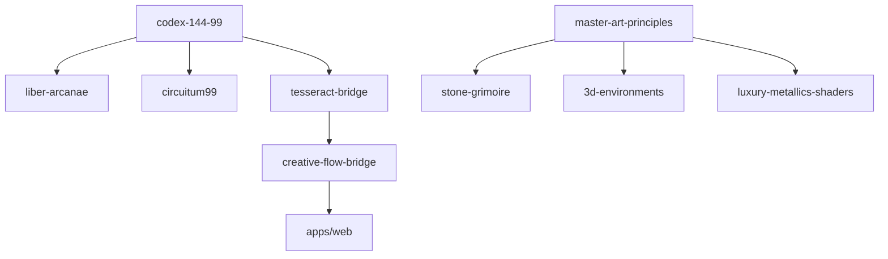

# Cathedral Architecture

## System Overview

Cathedral is a turborepo monorepo comprising 67 packages and 12 applications, unified by a sacred mathematics engine (Codex 144:99) and multi-modal creative tools.

```
┌─────────────────────────────────────────────────────────────────────┐
│                        CATHEDRAL PLATFORM                            │
├─────────────────────────────────────────────────────────────────────┤
│                                                                      │
│  ┌──────────────┐  ┌──────────────┐  ┌──────────────┐               │
│  │   Apps (12)  │  │ Packages (67)│  │ Rust Engines │               │
│  ├──────────────┤  ├──────────────┤  ├──────────────┤               │
│  │ web          │  │ codex-144-99 │  │ bevy         │               │
│  │ synth-lab    │  │ liber-arcanae│  │ dioxus       │               │
│  │ tarot-arena  │  │ circuitum99  │  │              │               │
│  │ ...          │  │ ...          │  │              │               │
│  └──────────────┘  └──────────────┘  └──────────────┘               │
│                                                                      │
├─────────────────────────────────────────────────────────────────────┤
│                       CORE SYSTEMS                                   │
├──────────────────┬──────────────────┬───────────────────────────────┤
│   CODEX 144:99   │  CREATIVE FLOW   │   SPIRAL DYNAMICS             │
│   Sacred Math    │  Mode Switching  │   Learning Engine             │
│   144 nodes      │  7 modes         │   9 levels                    │
│   99 gates       │  Seamless        │   Curriculum                  │
├──────────────────┴──────────────────┴───────────────────────────────┤
│                       DATA LAYER                                     │
│   codex/ · arcana/ · research/ · design/ · esoteric/                │
└─────────────────────────────────────────────────────────────────────┘
```

## Package Categories

### Core Intelligence (6 packages)

The foundational systems that power all other functionality.

| Package | Purpose | Dependencies |
|---------|---------|--------------|
| `codex-144-99` | Sacred mathematics | none |
| `liber-arcanae` | Tarot system | codex-144-99 |
| `circuitum99` | Narrative engine | codex-144-99 |
| `stone-grimoire` | Grimoire system | master-art-principles |
| `tesseract-bridge` | Integration | all core |
| `cosmogenesis-learning-engine` | Learning | codex-144-99 |

### Creative Tools (8 packages)

Multi-modal creative production systems.

| Package | Mode | Function |
|---------|------|----------|
| `synth` | Music | Sound synthesis |
| `art-generation-node` | Art | Visual generation |
| `cathedral-design-library` | Design | Design system |
| `fractal-sound-game-bridge` | Fusion | Cross-modal |
| `game-music-integration` | Game+Music | Integration |
| `violet-flame-transmutation` | Fusion | Transformation |
| `professional-design-suite` | Design | Production tools |
| `creative-engine` | All | Unified engine |

### Design Systems (5 packages)

Visual identity and rendering.

| Package | Focus |
|---------|-------|
| `japanese-design-system` | Luxury minimalist |
| `luxury-metallics-shaders` | PBR materials |
| `master-art-principles` | Sacred geometry |
| `visionary-art-colors` | Color palettes |
| `visionary-art-textures` | Texture systems |

### 3D Environments (3 packages)

Three-dimensional rendering and environments.

| Package | Engine |
|---------|--------|
| `3d-environments` | Three.js / Babylon |
| `luxcrux` | Spatial consciousness |
| `holographic-interface` | AR/VR ready |

### Game Systems (4 packages)

Interactive narrative and game mechanics.

| Package | Type |
|---------|------|
| `game-engine` | Core engine |
| `cyoa-book-game` | Choose-your-own |
| `fable-rpg-mechanics` | RPG systems |
| `magical-mystery-house` | Exploration |

## Data Architecture

```
data/
├── codex/                    # 144:99 sacred mathematics
│   ├── codex-144-expanded.json      # All 144 nodes
│   ├── codex_nodes.json             # Node definitions
│   ├── codex_14499.json             # Core ratios
│   ├── codex-arcanae-mirror.json    # Arcana mappings
│   └── node-registry-complete.json  # Registry
│
├── arcana/                   # Tarot system
│   ├── TAROT_MASTER_DATASET.json    # 78 cards
│   ├── complete-arcana-profiles.json
│   ├── majors.json                  # 22 Major Arcana
│   └── majors-complete.json
│
├── research/                 # Academic sources
│   ├── research-sources.json
│   ├── mcp-permanent-dataset.json
│   └── quality-guardian-registry.json
│
├── design/                   # Design assets
│   ├── pigments-database.json       # Rare pigments
│   ├── grimoire_concepts.json
│   └── design-suite/                # Export files
│
└── esoteric/                 # Correspondences
    ├── angels72.json                # 72 Shem Angels
    └── codex_of_abyssiae.json       # Abyss depths
```

## Integration Patterns

### Tesseract Bridge

The Tesseract Bridge provides seamless integration between all systems:

```typescript
import { tesseractBridge, creativeFlowBridge } from '@cathedral/tesseract-bridge';

// Switch creative modes
await creativeFlowBridge.toMusic();
await creativeFlowBridge.toArt();
await creativeFlowBridge.toGame();

// Sync data across systems
await tesseractBridge.syncRepositories(['circuitum99', 'stone-grimoire']);
```

### Codex Node Access

Every system can access Codex nodes for correspondences:

```typescript
import { PerfectCodex } from '@cathedral/codex-144-99';

const codex = new PerfectCodex();
const node = codex.getNode(42);

// node contains:
// - element (Fire/Water/Earth/Air/Spirit)
// - frequency (Solfeggio Hz)
// - tarot (Liber Arcanae card)
// - correspondences (I Ching, Shem Angels, etc.)
// - connections (related nodes)
```

### Spiral Dynamics Integration

Learning paths mapped to developmental levels:

```typescript
import { spiralDynamicsEngine } from '@cathedral/cosmogenesis-learning-engine';

const profile = spiralDynamicsEngine.createLearnerProfile('Alice');
const path = spiralDynamicsEngine.generateLearningPath(profile, 'yellow');

// Path includes modules for each level
// Each module has: game, music, art, design, research components
```

## Build System

### Turborepo

All packages are built via Turborepo for optimal caching:

```bash
pnpm build        # Build all
pnpm dev          # Development mode
pnpm test         # Run tests
```

### Package Dependencies



## Quality Enforcement

### Pre-commit Hooks

```bash
pnpm run validate:integrity  # Check all packages
pnpm run check:design        # Enforce design standards
```

### CI/CD Pipeline

1. **Lint** — TypeScript strict mode
2. **Build** — All packages compile
3. **Validate** — Integrity checks pass
4. **Design** — Quality boundary enforced
5. **Deploy** — To GitHub Pages, Vercel, Cloudflare

## Technology Stack

| Layer | Technology |
|-------|------------|
| Framework | React 18, Vite |
| Language | TypeScript 5.6 |
| Styling | CSS (no frameworks) |
| 3D | Three.js, Babylon.js |
| Audio | Tone.js, Web Audio |
| Build | Turborepo, pnpm |
| Game Engine | Bevy 0.14 (Rust) |
| Database | SQLite (local-first) |

---

*Architecture designed for extensibility, maintainability, and sacred geometry.*

