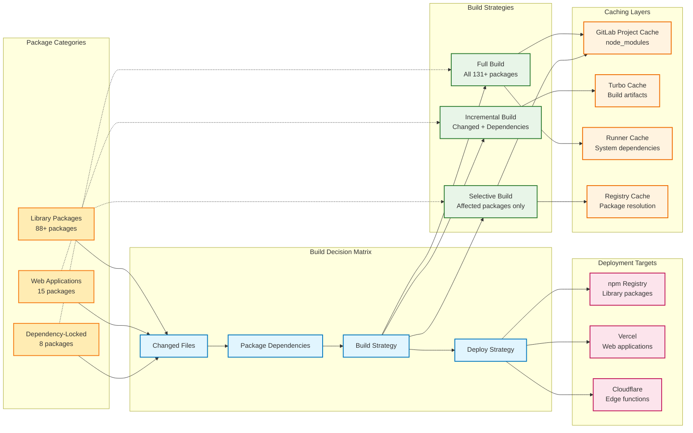
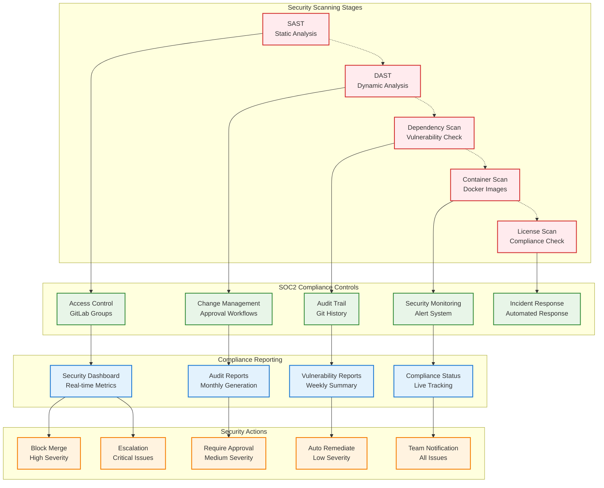

# Cathedral Real Enterprise GitLab Migration - Architecture Diagrams

## Deployment Architecture Overview

```mermaid
graph TB
    %% GitLab Repository Structure
    subgraph "GitLab Ultimate Organization"
        GRP[@cathedral-real]
        FND[@cathedral-real/foundation-core]
        APP[@cathedral-real/applications]
        MED[@cathedral-real/media-audio]
        ENT[@cathedral-real/professional-tools]
        LIB[@cathedral-real/libraries]
        INF[@cathedral-real/infrastructure]
    end

    %% Package Subgroups
    subgraph "Foundation Core (8 packages)"
        A1[art-engine-core]
        A2[sacred-geometry-core]
        A3[stone-grimoire-core]
        A4[liber-arcanae-core]
        A5[codex-144-99-core]
        A6[cosmogenesis]
        A7[cathedral-data-core]
        A8[circuitum99-core]
    end

    subgraph "Applications (15 packages)"
        B1[circuit-craft-creative-game]
        B2[hall-of-ateliers]
        B3[godot-design-studio]
        B4[godot-liber-arcanae]
        B5[holographic-interface]
        B6[avatar-experience-system]
        B7[cathedral-architect]
        B8[cosmogenesis-viewer]
        B9[stone-grimoire-viewer]
        B10[synth-lab-viewer]
        B11[palette-layout-editor]
        B12[symbolic-map-editor]
        B13[cosmogenesis-web-app]
        B14[atelier-web-app]
        B15[cathedralofcircuits]
    end

    %% Branch Strategy
    subgraph "Branch Strategy"
        BR1[main]
        BR2[develop]
        BR3[feature/*]
        BR4[release/*]
        BR5[hotfix/*]
    end

    %% CI/CD Pipeline
    subgraph "GitLab CI/CD Pipeline"
        CI1[Build Validation]
        CI2[Test Matrix<br/>Node 18/20/22]
        CI3[Type Check & Lint]
        CI4[SAST Security Scan]
        CI5[DAST Security Scan]
        CI6[Dependency Scan]
        CI7[SOC2 Compliance]
        CI8[Build Packages]
        CI9[Deploy Staging]
        CI10[Deploy Production]
    end

    %% Deployment Targets
    subgraph "Deployment Targets"
        V1[Vercel<br/>cathedralofcircuits]
        V2[Vercel<br/>hall-of-ateliers]
        V3[Vercel<br/>cosmogenesis]
        V4[Vercel<br/>circuit-craft]
        C1[Cloudflare Workers<br/>API Gateway]
        C2[Cloudflare Pages<br/>Documentation]
        N1[npm Registry<br/>88+ Libraries]
    end

    %% Cache & Performance
    subgraph "Performance Optimization"
        CACHE1[GitLab Cache<br/>node_modules]
        CACHE2[Turbo Cache<br/>Build Artifacts]
        CACHE3[pnpm Store<br/>Package Registry]
        CACHE4[TypeScript<br/>Incremental]
    end

    %% Connections
    GRP --> BR1
    GRP --> BR2
    GRP --> FND
    GRP --> APP
    GRP --> MED
    GRP --> ENT
    GRP --> LIB
    GRP --> INF

    FND --> A1
    FND --> A2
    FND --> A3
    FND --> A4
    FND --> A5
    FND --> A6
    FND --> A7
    FND --> A8

    APP --> B1
    APP --> B2
    APP --> B3
    APP --> B4
    APP --> B5
    APP --> B6
    APP --> B7
    APP --> B8
    APP --> B9
    APP --> B10
    APP --> B11
    APP --> B12
    APP --> B13
    APP --> B14
    APP --> B15

    BR1 --> CI1
    BR2 --> CI1
    BR3 --> CI1

    CI1 --> CI2
    CI1 --> CI3
    CI2 --> CI4
    CI3 --> CI5
    CI4 --> CI6
    CI5 --> CI7
    CI6 --> CI8
    CI7 --> CI9
    CI8 --> CI10

    CI8 --> CACHE1
    CI8 --> CACHE2
    CI8 --> CACHE3
    CI8 --> CACHE4

    CI9 --> V1
    CI9 --> V2
    CI9 --> V3
    CI9 --> V4
    CI9 --> C1
    CI9 --> C2
    CI9 --> N1

    CI10 --> V1
    CI10 --> V2
    CI10 --> V3
    CI10 --> V4
    CI10 --> C1
    CI10 --> C2
    CI10 --> N1

    classDef primary fill:#e1f5fe,stroke:#01579b,stroke-width:2px
    classDef secondary fill:#f3e5f5,stroke:#4a148c,stroke-width:2px
    classDef tertiary fill:#e8f5e8,stroke:#1b5e20,stroke-width:2px
    classDef cache fill:#fff3e0,stroke:#e65100,stroke-width:2px
    classDef build fill:#ffebee,stroke:#c62828,stroke-width:2px

    class GRP,FND,APP,MED,ENT,LIB,INF primary
    class V1,V2,V3,V4,C1,C2,N1 secondary
    class BR1,BR2,BR3,BR4,BR5 tertiary
    class CACHE1,CACHE2,CACHE3,CACHE4 cache
    class CI1,CI2,CI3,CI4,CI5,CI6,CI7,CI8,CI9,CI10 build
```

## CI/CD Pipeline Flow

```mermaid
graph TD
    %% Triggers
    TRIG1[Merge to develop]
    TRIG2[Push to main]
    TRIG3[Create release]
    TRIG4[Manual deployment]

    %% Stage 1: Validation
    subgraph "Stage 1: Validation & Testing"
        B1[Checkout Code]
        B2[Setup Node.js + pnpm]
        B3[Install Dependencies]
        B4[Type Check]
        B5[Lint Code]
        B6[Run Unit Tests]
        B7[Run Integration Tests]
    end

    %% Stage 2: Security
    subgraph "Stage 2: Security & Compliance"
        S1[SAST Scan<br/>Semgrep]
        S2[DAST Scan<br/>OWASP ZAP]
        S3[Dependency Scan<br/>Snyk]
        S4[License Scan<br/>FOSSA]
        S5[SOC2 Compliance<br/>Custom Checks]
        S6[Performance Test<br/>Lighthouse]
    end

    %% Stage 3: Build
   3: Build & Package"
        BUILD subgraph "Stage 1[Build Packages]
        BUILD2[Create Artifacts]
        BUILD3[Package Libraries]
        BUILD4[Generate Documentation]
        BUILD5[Create Docker Images]
    end

    %% Stage 4: Deploy
    subgraph "Stage 4: Deployment"
        D1[Deploy to Staging]
        D2[Integration Tests]
        D3[Deploy to Production]
        D4[Deploy to Vercel]
        D5[Deploy to Cloudflare]
        D6[Publish to npm]
    end

    %% Stage 5: Monitoring
    subgraph "Stage 5: Monitoring & Reporting"
        M1[Performance Metrics]
        M2[Security Reports]
        M3[Deployment Status]
        M4[Team Notifications]
    end

    %% Flow connections
    TRIG1 --> B1
    TRIG2 --> B1
    TRIG3 --> B1
    TRIG4 --> B1

    B1 --> B2
    B2 --> B3
    B3 --> B4
    B4 --> B5
    B5 --> B6
    B6 --> B7
    B7 --> S1

    S1 --> S2
    S2 --> S3
    S3 --> S4
    S4 --> S5
    S5 --> S6
    S6 --> BUILD1

    BUILD1 --> BUILD2
    BUILD2 --> BUILD3
    BUILD3 --> BUILD4
    BUILD4 --> BUILD5
    BUILD5 --> D1

    D1 --> D2
    D2 --> D3
    D3 --> D4
    D3 --> D5
    D3 --> D6

    D4 --> M1
    D5 --> M2
    D6 --> M3
    D3 --> M4

    %% Parallel execution hints
    S1 -.-> S2
    S2 -.-> S3
    BUILD2 -.-> BUILD3
    BUILD3 -.-> BUILD4

    classDef trigger fill:#ff9800,stroke:#e65100,stroke-width:2px
    classDef validation fill:#4caf50,stroke:#1b5e20,stroke-width:2px
    classDef security fill:#f44336,stroke:#c62828,stroke-width:2px
    classDef buildStage fill:#2196f3,stroke:#0d47a1,stroke-width:2px
    classDef deploy fill:#9c27b0,stroke:#4a148c,stroke-width:2px
    classDef monitor fill:#607d8b,stroke:#263238,stroke-width:2px

    class TRIG1,TRIG2,TRIG3,TRIG4 trigger
    class B1,B2,B3,B4,B5,B6,B7 validation
    class S1,S2,S3,S4,S5,S6 security
    class BUILD1,BUILD2,BUILD3,BUILD4,BUILD5 buildStage
    class D1,D2,D3,D4,D5,D6 deploy
    class M1,M2,M3,M4 monitor
```

## GitLab Group Hierarchy

```mermaid
graph TD
    %% Root Organization
    ROOT[@cathedral-real<br/>Organization]
    
    %% Main Groups
    ROOT --> CORE[@cathedral-real/core<br/>Core Packages]
    ROOT --> APPS[@cathedral-real/applications<br/>Web Applications]
    ROOT --> MEDIA[@cathedral-real/media<br/>Audio/Visual Tools]
    ROOT --> PROF[@cathedral-real/professional<br/>Enterprise Tools]
    ROOT --> LIBS[@cathedral-real/libraries<br/>Independent Packages]
    ROOT --> INFRA[@cathedral-real/infrastructure<br/>CI/CD & Templates]
    
    %% Core subgroups
    CORE --> CORE_FDN[@cathedral-real/core/foundation<br/>Foundation Components]
    CORE --> CORE_ENGINE[@cathedral-real/core/engine<br/>Engine Components]
    CORE --> CORE_DATA[@cathedral-real/core/data<br/>Data Systems]
    
    %% Applications subgroups  
    APPS --> APPS_WEB[@cathedral-real/applications/web<br/>Web Applications]
    APPS --> APPS_GAMES[@cathedral-real/applications/games<br/>Interactive Games]
    APPS --> APPS_TOOLS[@cathedral-real/applications/tools<br/>Creative Tools]
    
    %% Media subgroups
    MEDIA --> MEDIA_AUDIO[@cathedral-real/media/audio<br/>Audio Systems]
    MEDIA --> MEDIA_VISUAL[@cathedral-real/media/visual<br/>Visual Systems]
    MEDIA --> MEDIA_SYNTH[@cathedral-real/media/synthesis<br/>Synthesis Engines]
    
    %% Professional subgroups
    PROF --> PROF_SUITE[@cathedral-real/professional/suite<br/>Professional Suite]
    PROF --> PROF_COLLAB[@cathedral-real/professional/collaboration<br/>Collaboration Tools]
    PROF --> PROF_QUALITY[@cathedral-real/professional/quality<br/>Quality Control]
    
    %% Libraries subgroups
    LIBS --> LIBS_MATH[@cathedral-real/libraries/mathematics<br/>Math Libraries]
    LIBS --> LIBS_GEOM[@cathedral-real/libraries/geometry<br/>Geometry Libraries]
    LIBS --> LIBS_UTILS[@cathedral-real/libraries/utilities<br/>Utility Libraries]
    
    %% Infrastructure subgroups
    INFRA --> INFRA_CI[@cathedral-real/infrastructure/ci<br/>CI/CD Templates]
    INFRA --> INFRA_DEPLOY[@cathedral-real/infrastructure/deploy<br/>Deployment Scripts]
    INFRA --> INFRA_MONITOR[@cathedral-real/infrastructure/monitor<br/>Monitoring & Alerts]
    
    %% Permission inheritance arrows
    CORE_FDN -.-> CORE
    CORE_ENGINE -.-> CORE  
    CORE_DATA -.-> CORE
    
    APPS_WEB -.-> APPS
    APPS_GAMES -.-> APPS
    APPS_TOOLS -.-> APPS
    
    MEDIA_AUDIO -.-> MEDIA
    MEDIA_VISUAL -.-> MEDIA
    MEDIA_SYNTH -.-> MEDIA
    
    PROF_SUITE -.-> PROF
    PROF_COLLAB -.-> PROF
    PROF_QUALITY -.-> PROF
    
    LIBS_MATH -.-> LIBS
    LIBS_GEOM -.-> LIBS
    LIBS_UTILS -.-> LIBS
    
    INFRA_CI -.-> INFRA
    INFRA_DEPLOY -.-> INFRA
    INFRA_MONITOR -.-> INFRA

    classDef org fill:#e3f2fd,stroke:#0277bd,stroke-width:3px
    classDef group fill:#f3e5f5,stroke:#7b1fa2,stroke-width:2px
    classDef subgroup fill:#e8f5e8,stroke:#388e3c,stroke-width:1px

    class ROOT org
    class CORE,APPS,MEDIA,PROF,LIBS,INFRA group
    class CORE_FDN,CORE_ENGINE,CORE_DATA,APPS_WEB,APPS_GAMES,APPS_TOOLS,MEDIA_AUDIO,MEDIA_VISUAL,MEDIA_SYNTH,PROF_SUITE,PROF_COLLAB,PROF_QUALITY,LIBS_MATH,LIBS_GEOM,LIBS_UTILS,INFRA_CI,INFRA_DEPLOY,INFRA_MONITOR subgroup
```

## Package Deployment Flow



## Security & Compliance Pipeline



---

## Performance Monitoring Architecture

```mermaid
graph TB
    %% Monitoring Layers
    subgraph "Build Performance"
        BP1[Build Time<br/>Target < 4min]
        BP2[Cache Hit Rate<br/>Target > 85%]
        BP3[Test Execution<br/>Target < 2min]
        BP4[Package Resolution<br/>Target < 30s]
    end

    subgraph "Deployment Performance"
        DP1[Deployment Time<br/>Target < 2min]
        DP2[Rollback Time<br/>Target < 1min]
        DP3[Health Check<br/>Target 99% uptime]
        DP4[Error Rate<br/>Target < 1%]
    end

    subgraph "Security Performance"
        SP1[Scan Completion<br/>Target < 3min]
        SP2[Vulnerability Detection<br/>Real-time]
        SP3[Compliance Score<br/>Target 100%]
        SP4[Incident Response<br/>Target < 15min]
    end

    %% Alerts
    subgraph "Alert System"
        AL1[Slack Integration<br/>Team notifications]
        AL2[Email Alerts<br/>Management updates]
        AL3[GitLab Issues<br/>Automatic creation]
        AL4[PagerDuty<br/>Critical escalations]
    end

    %% Dashboard
    subgraph "Monitoring Dashboard"
        D1[GitLab Dashboard<br/>Pipeline metrics]
        D2[Grafana Dashboard<br/>Performance graphs]
        D3[Prometheus Metrics<br/>Time series data]
        D4[Custom Alerts<br/>Business metrics]
    end

    %% Flow
    BP1 --> D1
    BP2 --> D2
    BP3 --> D3
    BP4 --> D4

    DP1 --> D1
    DP2 --> D2
    DP3 --> D3
    DP4 --> D4

    SP1 --> D1
    SP2 --> D2
    SP3 --> D3
    SP4 --> D4

    D1 --> AL1
    D2 --> AL2
    D3 --> AL3
    D4 --> AL4

    classDef build fill:#4caf50,stroke:#2e7d32,stroke-width:2px
    classDef deploy fill:#2196f3,stroke:#1976d2,stroke-width:2px
    classDef security fill:#ff9800,stroke:#ef6c00,stroke-width:2px
    classDef alert fill:#f44336,stroke:#d32f2f,stroke-width:2px
    classDef dashboard fill:#9c27b0,stroke:#7b1fa2,stroke-width:2px

    class BP1,BP2,BP3,BP4 build
    class DP1,DP2,DP3,DP4 deploy
    class SP1,SP2,SP3,SP4 security
    class AL1,AL2,AL3,AL4 alert
    class D1,D2,D3,D4 dashboard
```



## Rollback & Disaster Recovery

```mermaid
graph TD
    %% Incident Detection
    INC[Incident Detected]
    
    %% Assessment
    ASSESS[Assess Impact<br/>Build failures<br/>Performance degradation<br/>Security breach]
    
    %% Decision Matrix
    DECISION{Severity Level}
    
    %% Rollback Strategies
    subgraph "Rollback Strategies"
        R1[Auto Rollback<br/>Failed build<br/>Performance < 80%]
        R2[Manual Approval<br/>Security issues<br/>Dependency problems]
        R3[Full Revert<br/>Critical system failure]
       <br/>Data corruption R4[Phased Rollback<br/>Partial deployment issues<br/>Regional problems]
    end

    %% Recovery Actions
    subgraph "Recovery Actions"
        REC1[Git Reset<br/>Previous commit]
        REC2[Cache Clear<br/>Build cache]
        REC3[Environment Reset<br/>Staging production]
        REC4[Database Rollback<br/>Data consistency]
    end

    %% Notification
    subgraph "Notifications"
        NOT1[Team Slack<br/>Immediate alert]
        NOT2[Management<br/>Executive summary]
        NOT3[Customer<br/>Status page update]
        NOT4[Audit Log<br/>Compliance record]
    end

    %% Recovery Verification
    subgraph "Recovery Verification"
        VER1[Health Check<br/>System status]
        VER2[Performance Test<br/>Benchmark validation]
        VER3[Security Scan<br/>Threat assessment]
        VER4[User Acceptance<br/>Functional test]
    end

    %% Flow
    INC --> ASSESS
    ASSESS --> DECISION
    DECISION --> R1
    DECISION --> R2
    DECISION --> R3
    DECISION --> R4

    R1 --> REC1
    R2 --> REC2
    R3 --> REC3
    R4 --> REC4

    REC1 --> NOT1
    REC2 --> NOT2
    REC3 --> NOT3
    REC4 --> NOT4

    NOT1 --> VER1
    NOT2 --> VER2
    NOT3 --> VER3
    NOT4 --> VER4

    %% Severity conditions
    DECISION -.->|Low| R1
    DECISION -.->|Medium| R2
    DECISION -.->|High| R3
    DECISION -.->|Critical| R4

    classDef incident fill:#ffebee,stroke:#d32f2f,stroke-width:2px
    classDef decision fill:#fff3e0,stroke:#f57c00,stroke-width:2px
    classDef rollback fill:#e8f5e8,stroke:#2e7d32,stroke-width:2px
    classDef recovery fill:#e3f2fd,stroke:#1976d2,stroke-width:2px
    classDef notification fill:#f3e5f5,stroke:#7b1fa2,stroke-width:2px
    classDef verification fill:#fff8e1,stroke:#f9a825,stroke-width:2px

    class INC,ASSESS incident
    class DECISION decision
    class R1,R2,R3,R4 rollback
    class REC1,REC2,REC3,REC4 recovery
    class NOT1,NOT2,NOT3,NOT4 notification
    class VER1,VER2,VER3,VER4 verification
```

These architecture diagrams provide a comprehensive visual representation of:

1. **Overall Deployment Architecture** - Shows the complete ecosystem flow from GitLab groups through CI/CD to deployment targets
2. **CI/CD Pipeline Flow** - Details the multi-stage pipeline with parallel execution
3. **GitLab Group Hierarchy** - Illustrates the organizational structure for 131+ packages
4. **Package Deployment Flow** - Shows decision matrix for build and deployment strategies
5. **Security & Compliance Pipeline** - Details SOC2 controls and security scanning
6. **Performance Monitoring** - Monitoring architecture for build and deployment performance
7. **Rollback & Disaster Recovery** - Incident response and recovery procedures

Each diagram includes:
- Clear visual hierarchy with color coding
- Parallel execution paths
- Decision points and conditional flows
- Integration points between systems
- Performance targets and metrics
- Security and compliance checkpoints