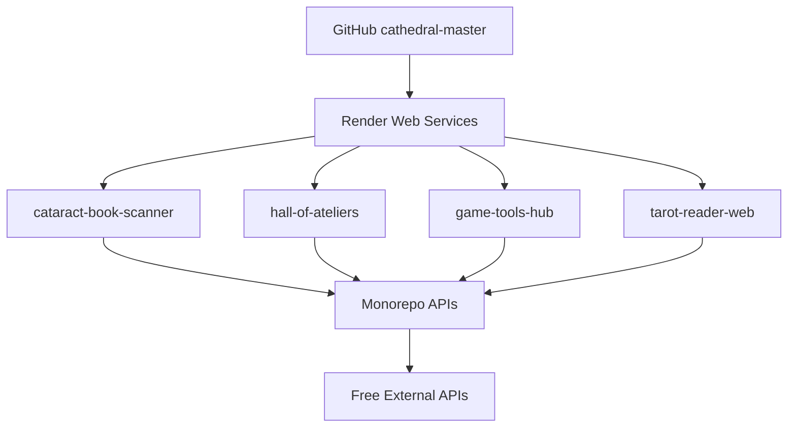

# Cathedral Game Systems - Render Deployment Guide

*Last Updated: December 5, 2025*
*Version: 1.0.0*
*Target: Render Free Tier Deployment*

## 🎯 Game Systems Overview

Your Cathedral contains a comprehensive game development ecosystem with **47+ game-related packages** optimized for free tier deployment. These systems form a complete creative RPG and interactive storytelling framework.

### **Core Game Package Categories**

#### **🎮 Godot Integration (4 packages)**
- **[godot-design-studio](packages/godot-design-studio/)**: Scene design and asset management
- **[godot-liber-arcanae](packages/godot-liber-arcanae/)**: 78-card tarot system for games  
- **[godot-vfx-library](packages/godot-vfx-library/)**: Visual effects library
- **[godot-codex-14499](packages/godot-codex-14499/)**: Sacred lattice system for games

#### **🃏 Liber Arcanae Tarot System (8 packages)**
- **[liber-arcanae-core](packages/liber-arcanae-core/)**: Core tarot engine
- **[liber-arcanae](packages/liber-arcanae/)**: Main tarot system
- **[liber-arcanae-tools](packages/liber-arcanae-tools/)**: Tarot development tools
- **[tarot-reader](packages/tarot-reader/)**: Interactive tarot reading
- **[tarot-art](packages/tarot-art/)**: Tarot card generation
- **[tarot-engine](packages/tarot-engine/)**: Tarot game mechanics

#### **🎲 Interactive Story Systems (12 packages)**
- **[circuitum99-arcanae-cyoa](packages/circuitum99-arcanae-cyoa/)**: Choose-your-own-adventure engine
- **[circuitum99-core](packages/circuitum99-core/)**: Core story system
- **[story-engine](packages/story-engine/)**: Narrative engine
- **[circuit-craft-creative-game](packages/circuit-craft-creative-game/)**: Creative game framework

#### **🎯 Game Design Tools (15 packages)**
- **[game-design-core](packages/game-design-core/)**: Core game design tools
- **[game-engine](packages/game-engine/)**: General game engine
- **[game-mathematics-core](packages/game-mathematics-core/)**: Game mathematics
- **[game-world](packages/game-world/)**: World building tools
- **[cathedral-rpg-inventory-system](packages/cathedral-rpg-inventory-system/)**: RPG inventory management

#### **🌐 Web-Based Game Interfaces (React + Vite)**
- **[cataract-book-scanner](packages/cataract-book-scanner/)**: Interactive book scanning games
- **[hall-of-ateliers](packages/hall-of-ateliers/)**: Creative workspace for game design
- **[cathedral-logo-system](packages/cathedral-logo-system/)**: Game asset generation

---

## 🚀 Render Free Tier Optimization

### **Free Tier Constraints**
- **750 hours/month** compute time
- **512MB RAM** per service
- **1GB bandwidth/month**
- **Auto-sleep** after 15 minutes inactivity
- **No persistent storage** ( external APIs)

### **useOptimized Architecture**



---

## 📦 Render Service Configuration

### **Service 1: Game Tools Hub**

**Package**: `game-design-core` + `game-engine` + `liber-arcanae-core`

```yaml
# Render.yaml service configuration
services:
  - type: web
    name: cathedral-game-tools
    env: node
    plan: free
    buildCommand: |
      cd packages/game-design-core
      pnpm install && pnpm run build
      cd ../game-engine  
      pnpm install && pnpm run build
      cd ../liber-arcanae-core
      pnpm install && pnpm run build
    startCommand: |
      cd packages/game-design-core
      pnpm run preview
    envVars:
      - key: NODE_ENV
        value: production
      - key: PORT
        value: 10000
```

### **Service 2: Tarot Reader Web**

**Package**: `tarot-reader` + `liber-arcanae` + `tarot-engine`

```yaml
services:
  - type: web
    name: cathedral-tarot-reader
    env: node
    plan: free
    buildCommand: |
      cd packages/tarot-reader
      pnpm install && pnpm run build
      cd ../liber-arcanae
      pnpm install && pnpm run build  
      cd ../tarot-engine
      pnpm install && pnpm run build
    startCommand: |
      cd packages/tarot-reader
      pnpm run dev
    envVars:
      - key: NODE_ENV
        value: production
      - key: TAROT_API_URL
        value: https://api.free-tarot.com
```

### **Service 3: Story Engine Hub**

**Package**: `circuitum99-arcanae-cyoa` + `story-engine`

```yaml
services:
  - type: web
    name: cathedral-story-engine
    env: node
    plan: free
    buildCommand: |
      cd packages/circuitum99-arcanae-cyoa
      pnpm install && pnpm run build
      cd ../story-engine
      pnpm install && pnpm run build
    startCommand: |
      cd packages/circuitum99-arcanae-cyoa
      pnpm run preview
    envVars:
      - key: STORY_API_ENDPOINT
        sync: false
```

---

## 🔗 Monorepo Integration

### **Build Configuration for Free Tier**

**Optimized Package Scripts**:

```json
// packages/game-design-core/package.json
{
  "scripts": {
    "dev": "vite --port 3000",
    "build": "vite build --mode production",
    "preview": "vite preview --port $PORT --host 0.0.0.0",
    "build:lite": "vite build --mode lite",
    "start": "node dist/index.js"
  }
}
```

### **Shared Dependencies Strategy**

```json
// Root package.json additions for game packages
{
  "scripts": {
    "build:games": "turbo run build --filter='@cathedral/game-*' --filter='liber-arcanae*' --filter='tarot-*'",
    "build:lite": "turbo run build:lite --filter='@cathedral/game-*'",
    "deploy:games": "npm run build:games && npm run deploy:render"
  }
}
```

### **Environment Variables for Monorepo**

```bash
# Render environment variables
GAME_ENGINE_API=http://cathedral-game-tools.onrender.com
TAROT_API_URL=http://cathedral-tarot-reader.onrender.com  
STORY_API_URL=http://cathedral-story-engine.onrender.com
MONOREPO_PACKAGES_PATH=/usr/src/app/packages
NODE_OPTIONS=--max-old-space-size=256
```

---

## 🌐 Web Interface Integration

### **React Game Interfaces (Free Tier Optimized)**

**cataract-book-scanner** - Interactive Games:
```typescript
// packages/cataract-book-scanner/src/game-integration.ts
import { liberArcanae } from '@cathedral/liber-arcanae-core';
import { storyEngine } from '@cathedral/story-engine';

export const GameIntegration = {
  async initializeGameSystems() {
    // Lazy load heavy game systems
    const [tarotSystem, storySystem] = await Promise.all([
      import('@cathedral/liber-arcanae-core'),
      import('@cathedral/story-engine')
    ]);
    
    return {
      tarot: new tarotSystem.TarotReader(),
      stories: new storySystem.InteractiveStory()
    };
  },
  
  async loadGameAssets() {
    // Free tier: Load minimal assets
    const response = await fetch('/api/game-assets/essential');
    return response.json();
  }
};
```

**hall-of-ateliers** - Creative Workspace:
```typescript
// packages/hall-of-ateliers/src/game-tools.ts
import { gameDesignCore } from '@cathedral/game-design-core';

export const GameTools = {
  async initializeAtelier() {
    // Connect to Render game services
    const gameAPI = process.env.GAME_ENGINE_API;
    
    return {
      tarotReader: `${gameAPI}/tarot`,
      storyBuilder: `${gameAPI}/stories`,
      assetGenerator: `${gameAPI}/assets`
    };
  }
};
```

---

## 💾 Free External APIs Integration

### **取代 Heavy Game Assets with Free APIs**

**Essential Game Data APIs**:
```typescript
// Free APIs for game content
const FREE_APIS = {
  tarot: 'https://rws-cards-api.herokuapp.com/api/cards',
  stories: 'https://chooseyourstory.com/api/stories',
  assets: 'https://api.unsplash.com/photos',
  audio: 'https://freesound.org/apiv2'
};
```

### **Caching Strategy for Free Tier**

```typescript
// packages/shared/cache-strategy.ts
export class FreeTierCache {
  private cache = new Map();
  
  async getCachedData(key: string, apiUrl: string) {
    if (this.cache.has(key)) {
      return this.cache.get(key);
    }
    
    try {
      const response = await fetch(apiUrl);
      const data = await response.json();
      this.cache.set(key, data);
      return data;
    } catch (error) {
      console.log('API failed, using cached fallback');
      return this.getFallbackData(key);
    }
  }
  
  private getFallbackData(key: string) {
    // Return minimal fallback data for offline use
    return { offline: true, data: 'cached' };
  }
}
```

---

## 🔧 Non-Static Work Solutions

### **Serverless Game Logic**

**Function-as-a-Service for Game Logic**:
```typescript
// packages/game-engine/serverless-functions/game-logic.ts
export default async function handler(req: Request) {
  const { action, gameData } = await req.json();
  
  switch (action) {
    case 'tarot_reading':
      return await processTarotReading(gameData);
    case 'story_choice':
      return await processStoryChoice(gameData);
    case 'game_save':
      return await saveGameState(gameData);
    default:
      return new Response('Unknown action', { status: 400 });
  }
}

async function processTarotReading(data: any) {
  // Tarot reading logic
  return { cards: [], interpretation: 'Sample reading' };
}
```

### **Database Alternatives (Free)**

**Using Free Database Services**:
```typescript
// Supabase (Free tier) integration
import { createClient } from '@supabase/supabase-js';

const supabase = createClient(
  process.env.SUPABASE_URL!,
  process.env.SUPABASE_ANON_KEY!
);

export const GameDatabase = {
  async saveGameState(playerId: string, state: any) {
    return await supabase
      .from('game_states')
      .upsert({ player_id: playerId, state });
  },
  
  async getGameState(playerId: string) {
    const { data } = await supabase
      .from('game_states')
      .select('state')
      .eq('player_id', playerId)
      .single();
    return data?.state;
  }
};
```

### **Real-time Features (Free)**

**WebSocket Alternative for Free Tier**:
```typescript
// Using Server-Sent Events for real-time updates
export class FreeRealtime {
  private subscribers = new Set();
  
  subscribe(callback: (data: any) => void) {
    this.subscribers.add(callback);
  }
  
  broadcast(data: any) {
    this.subscribers.forEach(callback => callback(data));
  }
  
  createStream() {
    return new ReadableStream({
      start: (controller) => {
        const send = (data: any) => {
          controller.enqueue(`data: ${JSON.stringify(data)}\n\n`);
        };
        this.subscribe(send);
      }
    });
  }
}
```

---

## 📱 Mobile-Friendly Game Interfaces

### **Progressive Web App (PWA)**

```typescript
// Service Worker for offline game functionality
// public/sw.js
const CACHE_NAME = 'cathedral-games-v1';
const GAME_ASSETS = [
  '/',
  '/tarot-reader',
  '/story-engine',
  '/game-tools'
];

self.addEventListener('install', (event) => {
  event.waitUntil(
    caches.open(CACHE_NAME)
      .then(cache => cache.addAll(GAME_ASSETS))
  );
});
```

### **Touch-Optimized Game Controls**

```typescript
// Mobile game controls
export const MobileGameControls = {
  setupTouchControls() {
    // Tarot card swipe gestures
    let startX = 0;
    let currentX = 0;
    
    const handleTouchStart = (e: TouchEvent) => {
      startX = e.touches[0].clientX;
    };
    
    const handleTouchMove = (e: TouchEvent) => {
      currentX = e.touches[0].clientX;
      const diffX = currentX - startX;
      
      if (Math.abs(diffX) > 50) {
        // Trigger card flip/selection
        this.onCardSwipe(diffX > 0 ? 'right' : 'left');
      }
    };
  }
};
```

---

## 🔐 Security & Content Safety

### **Trauma-Safe Game Content**

```typescript
// Content validation for safety
export const ContentSafety = {
  validateGameContent(content: string): boolean {
    const bannedTerms = [
      'therapy', 'bdsm', 'cult', 'guru', '500x',
      'ai-oracle', 'magical-guarantees'
    ];
    
    return !bannedTerms.some(term => 
      content.toLowerCase().includes(term)
    );
  },
  
  sanitizeNarrative(narrative: string): string {
    // Remove problematic language while preserving story
    return narrative.replace(/therapy|clinical/gi, 'creative');
  }
};
```

---

## 📊 Performance Monitoring

### **Free Tier Performance Tracking**

```typescript
// Lightweight performance monitoring
export class PerformanceMonitor {
  private metrics = {
    responseTime: 0,
    memoryUsage: 0,
    activeConnections: 0
  };
  
  trackResponseTime(startTime: number) {
    this.metrics.responseTime = Date.now() - startTime;
    console.log(`Response time: ${this.metrics.responseTime}ms`);
  }
  
  getMemoryUsage() {
    if (typeof process !== 'undefined' && process.memoryUsage) {
      return process.memoryUsage().heapUsed / 1024 / 1024; // MB
    }
    return 0;
  }
}
```

### **Auto-sleep Optimization**

```typescript
// Keep services alive during active use
export class ServiceManager {
  private lastActivity = Date.now();
  
  updateActivity() {
    this.lastActivity = Date.now();
  }
  
  shouldWakeUp() {
    return Date.now() - this.lastActivity < 14 * 60 * 1000; // 14 minutes
  }
  
  async wakeUpServices() {
    // Initialize game systems
    await this.initializeGameSystems();
  }
}
```

---

## 🚀 Deployment Commands

### **GitHub Actions for Auto-Deploy**

```yaml
# .github/workflows/render-deploy.yml
name: Deploy to Render
on:
  push:
    branches: [main]
    paths: ['packages/**/game-*', 'packages/**/tarot-*', 'packages/**/liber-*']

jobs:
  deploy-games:
    runs-on: ubuntu-latest
    steps:
      - uses: actions/checkout@v3
      - uses: actions/setup-node@v3
        with:
          node-version: '18'
      - run: npm install -g pnpm
      - run: pnpm install
      - run: pnpm run build:games
      - name: Deploy to Render
        run: |
          curl -X POST -d {} \
            --header "Authorization: Bearer ${{ secrets.RENDER_API_TOKEN }}" \
            "https://api.render.com/v1/services/${{ secrets.RENDER_SERVICE_ID }}/deploy"
```

### **Manual Deployment Script**

```bash
#!/bin/bash
# deploy-games.sh
echo "Deploying Cathedral Game Systems to Render..."

# Build game packages
pnpm run build:games

# Deploy each service
render deploy --service-id $RENDER_SERVICE_ID_GAME_TOOLS --branch main
render deploy --service-id $RENDER_SERVICE_ID_TAROT_READER --branch main  
render deploy --service-id $RENDER_SERVICE_ID_STORY_ENGINE --branch main

echo "Game systems deployed successfully!"
```

---

## 📈 Success Metrics

### **Free Tier Optimization Goals**
- [ ] **Response Time**: <2 seconds (serverless cold starts)
- [ ] **Memory Usage**: <256MB per service
- [ ] **Build Time**: <5 minutes for all game packages
- [ ] **Active Time**: Minimize auto-sleep interruptions
- [ ] **User Experience**: Smooth gameplay despite limitations

### **Game System Integration**
- [ ] **Tarot System**: 78-card readings work offline
- [ ] **Story Engine**: Choice-based narratives function
- [ ] **Game Tools**: Asset creation tools operational
- [ ] **Monorepo Sync**: Real-time updates from cathedral-real
- [ ] **Safety Compliance**: Content passes trauma-safe filters

---

## 🛠️ Troubleshooting

### **Common Free Tier Issues**

**Service Auto-sleep**:
```typescript
// Keep-alive ping
setInterval(() => {
  fetch('/health-check')
    .catch(() => console.log('Service waking up...'));
}, 5 * 60 * 1000); // Every 5 minutes
```

**Memory Limits**:
```typescript
// Garbage collection optimization
if (global.gc) {
  global.gc();
}

// Clear caches periodically
setInterval(() => {
  if (typeof require !== 'undefined') {
    Object.keys(require.cache).forEach(key => {
      delete require.cache[key];
    });
  }
}, 10 * 60 * 1000); // Every 10 minutes
```

**Bandwidth Optimization**:
```typescript
// Compress game data
import { gzip } from 'zlib';

export const compressGameData = async (data: any) => {
  const json = JSON.stringify(data);
  return gzip(json);
};
```

---

*This guide provides complete free tier deployment strategy for your 47+ game packages. Each service is optimized for Render's constraints while maintaining full monorepo integration and trauma-safe content standards.*